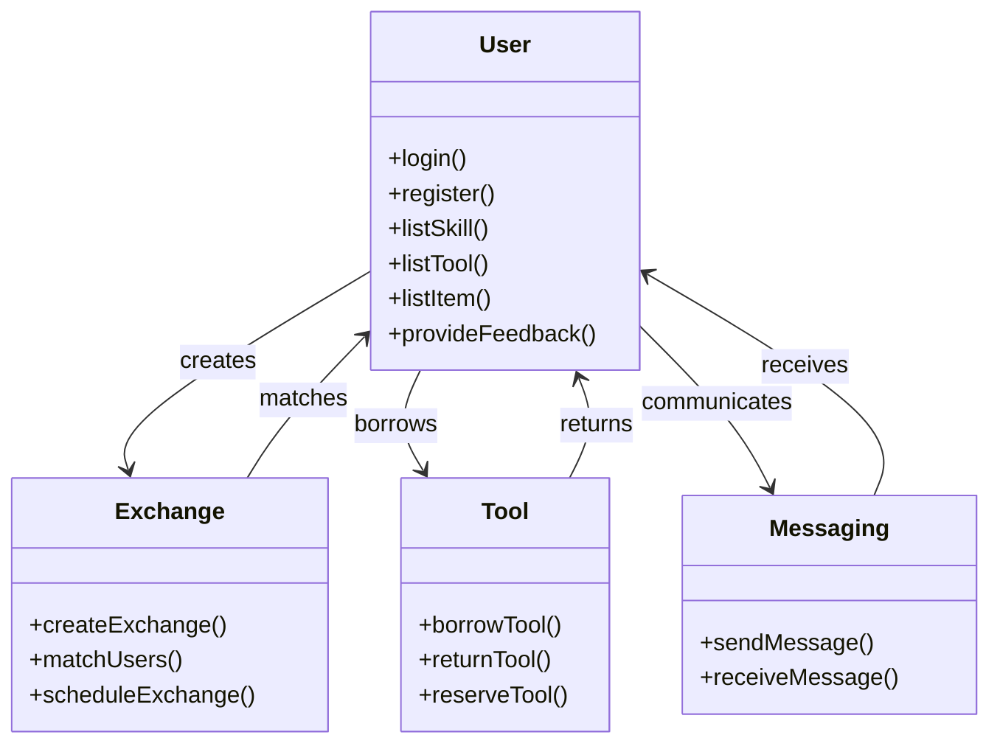

# Project Proposal: e-Sharevice

## Overview

**e-Sharevice** is a React-based application designed to facilitate the exchange of skills, tools, and unused items within a community. By leveraging modern technology, the app aims to foster stronger community bonds, reduce waste, and promote cost-effective living through shared resources.

## Project Goals

The primary goals of e-Sharevice are:

1. To connect neighbors for exchanging skills and services.
2. To create a community tool library where users can borrow tools and equipment.
3. To facilitate the exchange of unused items, reducing waste and unnecessary purchases.

## Problem Identification

Many communities lack a centralized platform for sharing skills, tools, and items, leading to underutilized resources and missed opportunities for cost savings and community engagement. e-Sharevice aims to address these issues by providing a convenient and user-friendly solution.

## Target Audience

The intended user base for e-Sharevice includes:

- Individuals looking to exchange skills and services within their community.
- Homeowners and DIY enthusiasts needing occasional access to tools.
- People looking to reduce waste by swapping unused items.

## User Needs and Features

### User Needs

The needs of the target users were identified through research and community feedback. Key needs include reliable matchmaking for exchanges, secure in-app communication, and a fair system for managing transactions.

### Feature List

1. **User Profiles**: Create and manage profiles listing skills, tools, and items available for exchange.
2. **Matchmaking**: Match users based on skill needs, tool requirements, and item availability.
3. **In-App Communication**: Messaging and scheduling functionality within the app.
4. **Community Ratings**: Users can rate and review each other after exchanges.
5. **Credit System**: Points or credits for fair exchange of services and items.
6. **Reservation System**: Borrowing and reservation functionality for tools.
7. **DIY Guides and Skill Learning**: Project ideas and guides for using tools and developing skills.

### Feature Prioritization

Features were prioritized based on their impact on user engagement and community benefits, with matchmaking, communication, and ratings being the top priorities.

## Implementation Details

### Tech Stack Choice

- **Frontend**: React for a responsive and modular user interface.
- **Backend**: Node.js and Express for robust server-side operations.
- **Database**: PostgreSQL/MySQL for managing user data, exchanges, and transactions.
- **State Management**: Redux for managing the application state.

### Client Libraries

- **React**: For building the user interface.
- **Axios**: For API calls and data handling.

### Server Libraries

- **Express**: For creating API endpoints.
- **Knex**: For database management.

### Security Measures

To ensure secure access and data management, the following measures will be implemented:

- **JWT (JSON Web Tokens)**: For user authentication and authorization.
- **Data Encryption**: Protect user data in transit and storage.

### API and Endpoints

Endpoints are structured to handle user interactions, exchanges, and authentication:

- **GET /exchanges**: Fetch available skills, tools, and items for exchange.
- **POST /users/register**: User registration with secure authentication methods.
- **POST /users/login**: User login using secure authentication methods.
- **POST /exchanges/create**: Create a new exchange request or offer.
- **GET /exchanges/:id**: Fetch details of a specific exchange.

## User Experience

User feedback will be collected through:

- **In-App Feedback**: Allow users to provide feedback within the app.
- **Community Engagement**: Engage with users through forums and social media.

## Data Management

### Data Privacy

User data privacy is maintained through encryption and secure storage practices, with options for users to manage their data.

### Data Quality

Regular audits and validations ensure data accuracy and reliability.

## Development and Deployment Roadmap

1. **Create Client**: React project with routes and boilerplate pages.
2. **Create Server**: Express project with routing, with placeholder 200 responses.
3. **Create Migrations**: Set up database structure for user data, exchanges, and transactions.
4. **Create Seeds**: Gather sample data for initial testing.
5. **Deploy Client and Server Projects**: Deploy to cloud platforms so all commits are reflected in production.

### Feature Development

1. **User Profiles**: Implement user profile creation and management.
2. **Matchmaking**: Implement matchmaking functionality for skills, tools, and items.
3. **In-App Communication**: Implement messaging and scheduling within the app.
4. **Community Ratings**: Implement rating and review system for exchanges.
5. **Tool Reservation System**: Implement borrowing and reservation functionality for tools.

### Nice to Have

- **Credit System**: Implement points or credits for fair exchange.
- **DIY Guides and Skill Learning**: Integrate project ideas and guides.

### Bug Fixes

Regular bug fixing and testing to ensure the stability and usability of the app.

## Risk Management

### Risk Identification

Potential risks include data breaches, inaccurate matchmaking, and user safety concerns.

### Risk Mitigation

Strategies include robust security measures, continuous algorithm improvement, and clear user disclaimers.

## User Support

### Customer Support

Provide support through in-app help, email, and live chat options.

### Community Building

Engage with users through forums, social media, and feedback channels to build a supportive community.

# UML Diagram

Below is a Mermaid syntax UML diagram illustrating the basic structure of e-Sharevice.

# Disclaimer

This proposal outlines a long-term overview for Project e-Sharevice. Please note that features, technologies, and implementation details might change depending on circumstances and user feedback. The aim is to remain flexible and responsive to the needs of the end users and project requirements, ensuring that the final product provides the best possible support and functionality for community sharing.
